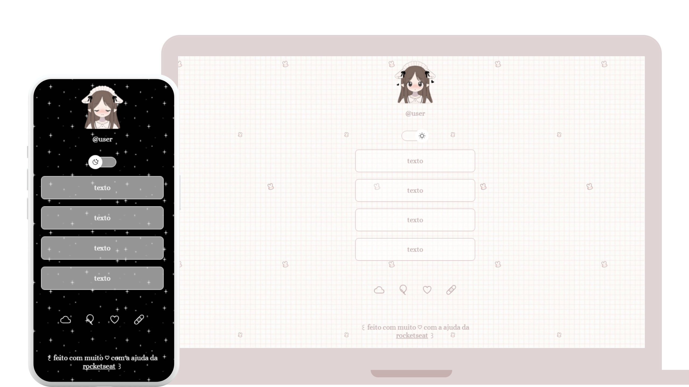

# Projeto DevLinks ♡

Projeto DevLinks, feito com a ajuda do curso gratuito da Rocketseat 🚀 

As técnicas e conceitos apresentados nos vídeos e materiais do curso foram aplicados nesse projeto, com modificações nas imagens e no tema!

## Tecnologias ♡

Esse projeto foi desenvolvido com:

- HTML e CSS 
- JavaScript
- Git e Github

## Funcionalidades ♡

- Temas dark e light
- Adicionar links  externos

## Licença ♡

Por se tratar de uma atividade educacional, não incluí uma licença para uso externo ou distribuição (MIT) 

## Agradecimentos ♡
Quero agradecer primeiramente à Rocketseat por proporcionar tantos conteúdos incríveis. ♡

E também agradecer ao professor desse curso, Mayk Brito, por ensinar tão bem e tornar essa experiência mais leve e de fácil entendimento! ♡